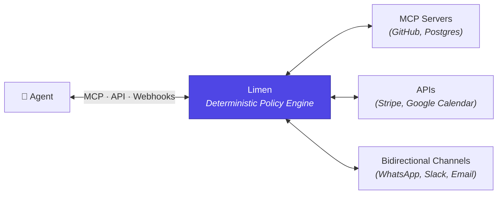

# Limen

An open-source permissions layer for defining what AI agents can do with your tools.

LLM mistakes are cheap. Tool calls are not. Limen deterministically enforces policies — so your agents can act on real systems without you losing sleep.

## How it works

The agent reasons. Limen decides what actually runs. Your agents stay the same — control lives outside.

## The problem

AI agents can now call Stripe, send messages, modify calendars, and query your database. Every hallucination, misinterpretation, or prompt injection becomes a real-world action.

Prompt-level guardrails don't work. The key must be stored in a safe place, not inside the thief's head.

Direct tool access turns intelligence into authority. Without explicit control, tool access becomes the blast radius.

## What Limen does

**Deterministic control, not trust.**
Define explicit rules that cannot be bypassed by prompts, reasoning, or model behavior.

> Allow reads. Limit writes. Block destructive actions. Require approval for payments over $100.

**Human authority where it matters.**
Require human approval for sensitive actions — without blocking everything else.

> Let agents create calendar events. Require approval to reschedule or delete.

**Separate reasoning from power.**
Agents can think freely. Execution is enforced elsewhere. Policies live outside the agent and apply consistently across systems.

## Use case example #1: OpenClaw + Safe WhatsApp

Limen's channel feature limits OpenClaw's communication via WhatsApp: filtering inbound messages from specific numbers/groups and enforcing outbound policies — all through deterministic rules.

## Use case example #2: Agent sends emails with human approval

Limen's MCP policies give the agent controlled access to the user's email. The agent is allowed to read messages and write drafts. Sending messages requires human approval that can't be bypassed. Message approval requests are sent to the user on Slack, WhatsApp, Telegram, or approved through Limen's dashboard.

## Status

Building in public. Coming soon.

**Stack:** TypeScript · Next.js · PostgreSQL · Drizzle

---
Star this repo to get updates.

Follow along as I build in public on X: [@andrino_daniel](https://x.com/andrino_daniel)
