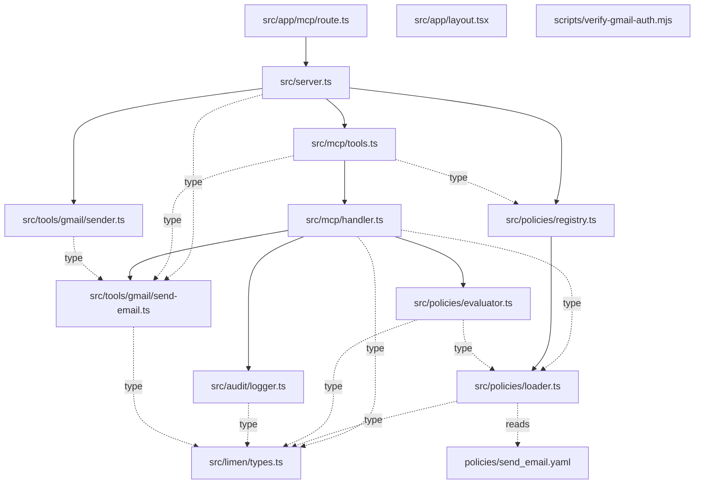

```mermaid
flowchart TD
  route["src/app/mcp/route.ts"]
  server["src/server.ts"]
  mcpTools["src/mcp/tools.ts"]
  handler["src/mcp/handler.ts"]
  auditLogger["src/audit/logger.ts"]

  registry["src/policies/registry.ts"]
  loader["src/policies/loader.ts"]
  evaluator["src/policies/evaluator.ts"]
  limenTypes["src/limen/types.ts"]
  policyYaml["policies/send_email.yaml"]

  sendEmail["src/tools/gmail/send-email.ts"]
  gmailSender["src/tools/gmail/sender.ts"]

  layout["src/app/layout.tsx"]
  verifyGmail["scripts/verify-gmail-auth.mjs"]

  route --> server

  server --> mcpTools
  server --> registry
  server --> gmailSender
  server -. type .-> sendEmail

  mcpTools --> handler
  mcpTools -. type .-> registry
  mcpTools -. type .-> sendEmail

  handler --> auditLogger
  handler --> evaluator
  handler --> sendEmail
  handler -. type .-> loader
  handler -. type .-> limenTypes

  registry --> loader

  loader -. type .-> limenTypes
  loader -. reads .-> policyYaml

  evaluator -. type .-> loader
  evaluator -. type .-> limenTypes

  auditLogger -. type .-> limenTypes
  sendEmail -. type .-> limenTypes
  gmailSender -. type .-> sendEmail
```
