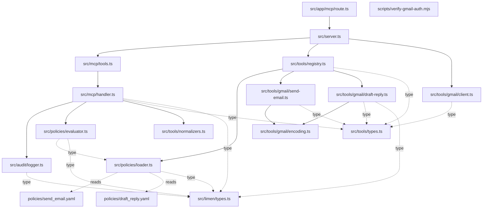

```mermaid
flowchart TD
  route["src/app/mcp/route.ts"]
  server["src/server.ts"]
  mcpTools["src/mcp/tools.ts"]
  handler["src/mcp/handler.ts"]
  auditLogger["src/audit/logger.ts"]
  normalizers["src/tools/normalizers.ts"]

  toolsRegistry["src/tools/registry.ts"]
  toolsTypes["src/tools/types.ts"]
  loader["src/policies/loader.ts"]
  evaluator["src/policies/evaluator.ts"]
  limenTypes["src/limen/types.ts"]
  sendEmailYaml["policies/send_email.yaml"]
  draftReplyYaml["policies/draft_reply.yaml"]

  sendEmail["src/tools/gmail/send-email.ts"]
  draftReply["src/tools/gmail/draft-reply.ts"]
  encoding["src/tools/gmail/encoding.ts"]
  gmailClient["src/tools/gmail/client.ts"]

  verifyGmail["scripts/verify-gmail-auth.mjs"]

  route --> server

  server --> mcpTools
  server --> toolsRegistry
  server --> gmailClient

  mcpTools --> handler

  handler --> auditLogger
  handler --> evaluator
  handler --> normalizers
  handler -. type .-> toolsTypes
  handler -. type .-> limenTypes

  toolsRegistry --> loader
  toolsRegistry --> sendEmail
  toolsRegistry --> draftReply
  toolsRegistry -. type .-> toolsTypes

  loader -. reads .-> sendEmailYaml
  loader -. reads .-> draftReplyYaml
  loader -. type .-> limenTypes

  evaluator -. type .-> loader
  evaluator -. type .-> limenTypes

  auditLogger -. type .-> limenTypes

  sendEmail --> encoding
  sendEmail -. type .-> toolsTypes

  draftReply --> encoding
  draftReply -. type .-> toolsTypes
  draftReply -. type .-> limenTypes

  gmailClient -. type .-> toolsTypes
```
